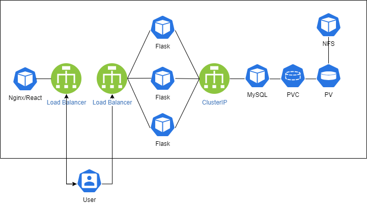
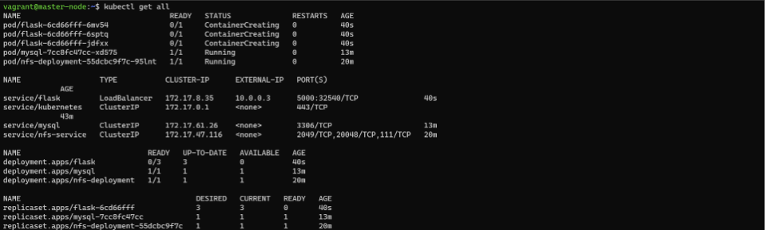
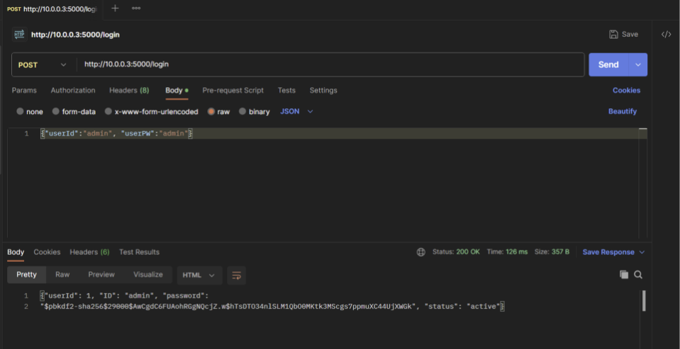
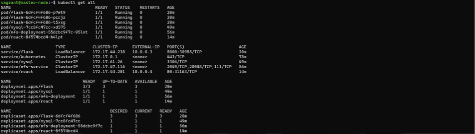
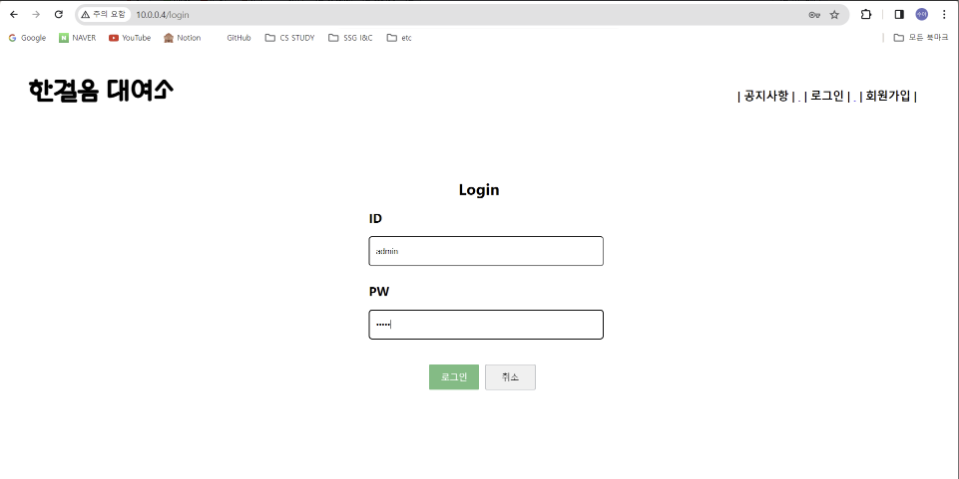
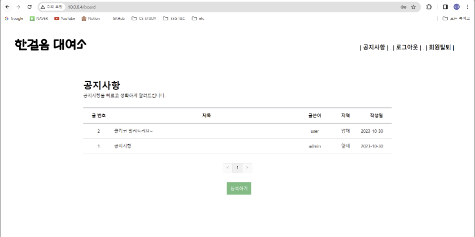
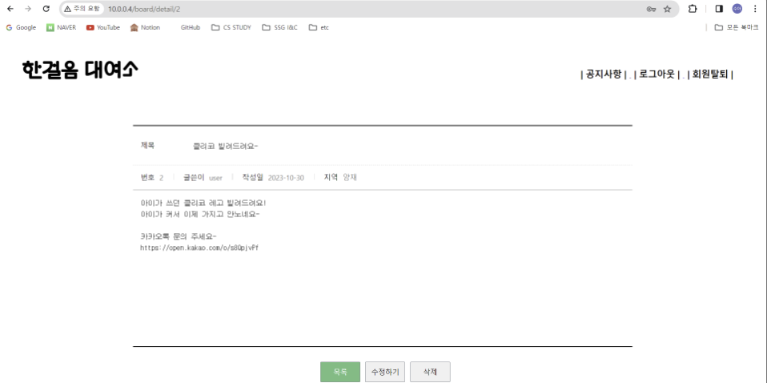

## 한걸음 대여소 쿠버네티스 배포



### 볼륨 생성
#### nfs 볼륨 사용
=> nfs는 네트워크 파일 시스템으로 제 3위치에 있치에 있어 제약이 없다.
hostPath의 경우 노드 안 레포지터를 이용하기 때문에 노드가 다른 경우 데이터 공유가 어렵다.

#### nfs 디플로이먼트&서비스 생성
```shell
kubectl apply -f nfs-deployment-service.yaml
```

#### 퍼시스턴트 볼륨(pv) 생성
```shell
cat nfs-persistentvolume.yaml | sed "s/{CLUSTER-IP}/$(kubectl get service nfs-service -o jsonpath='{.spec.clusterIP}')/g" | kubectl apply -f -
```

#### 퍼시스턴트 볼륨 클레임(pvc) 생성
```shell
kubectl apply -f nfs-persistentvolumeclaim.yaml
```
#### pv, pvc가 잘 바운드 되었는지 확인
```shell
kubectl get pv,pvc,pod
NAME                                    CAPACITY   ACCESS MODES   RECLAIM POLICY   STATUS   CLAIM                               STORAGECLASS   REASON   AGE
persistentvolume/nfs-persistentvolume   1Gi        RWO            Retain           Bound    default/nfs-persistentvolumeclaim                           35s

NAME                                              STATUS   VOLUME                 CAPACITY   ACCESS MODES   STORAGECLASS   AGE
persistentvolumeclaim/nfs-persistentvolumeclaim   Bound    nfs-persistentvolume   1Gi        RWO                           8s

NAME                                  READY   STATUS    RESTARTS   AGE
pod/nfs-deployment-55dcbc9f7c-4chjw   1/1     Running   0          97s
```
### 디플로이먼트에 사용할 시크릿 생성
```shell
kubectl apply -f secrets.yaml
```

### MySQL
#### MySQL 디플로이먼트 및 서비스 생성
```shell
kubectl apply -f mysql-deployment-service.yaml
```
#### mysql 디플로이먼트 생성 전 nfs를 설치 및 작동시켜줘야한다.
node01, node02에 들어가 nfs 설치 후 활성화
```shell
ssh vagrant@10.0.0.11
sudo apt-get install nfs-common
systemctl status nfs-common
○ nfs-common.service
     Loaded: masked (Reason: Unit nfs-common.service is masked.)
     Active: inactive (dead)  // 마스크되어 비활성화되어 있는 것을 확인
sudo mv /lib/systemd/system/nfs-common.service /lib/systemd/system/nfs-common.service.bak
sudo systemctl daemon-reload
sudo systemctl restart nfs-common
systemctl status nfs-common
● nfs-common.service - LSB: NFS support files common to client and server
     Loaded: loaded (/etc/init.d/nfs-common; generated)
     Active: active (running) since Wed 2023-11-01 00:43:05 UTC; 4s ago
       Docs: man:systemd-sysv-generator(8)
    Process: 9556 ExecStart=/etc/init.d/nfs-common start (code=exited, stat>
      Tasks: 2 (limit: 2220)
     Memory: 5.0M
        CPU: 324ms
     CGroup: /system.slice/nfs-common.service
             ├─9564 /sbin/rpc.statd
             └─9590 /usr/sbin/rpc.idmapd

Nov 01 00:43:04 worker-node01 systemd[1]: Starting LSB: NFS support files c>
Nov 01 00:43:04 worker-node01 nfs-common[9556]:  * Starting NFS common util>
lines 1-14
// nfs 활성화된 것을 확인
```

#### pod안으로 들어가서 초기 데이터베이스가 존재하는 지 확인
```shell
kubectl exec -it pod/mysql-7cc8fc47cc-trhqj -- sh
sh-4.4# mysql -u root -p
Enter password:
Welcome to the MySQL monitor.  Commands end with ; or \g.
Your MySQL connection id is 8
Server version: 8.1.0 MySQL Community Server - GPL

Copyright (c) 2000, 2023, Oracle and/or its affiliates.

Oracle is a registered trademark of Oracle Corporation and/or its
affiliates. Other names may be trademarks of their respective
owners.

Type 'help;' or '\h' for help. Type '\c' to clear the current input statement.

mysql> show databases;
+--------------------+
| Database           |
+--------------------+
| firststep          |
| information_schema |
| mysql              |
| performance_schema |
| sys                |
+--------------------+
5 rows in set (0.01 sec)

mysql> use firststep
Reading table information for completion of table and column names
You can turn off this feature to get a quicker startup with -A

Database changed
mysql> select * from user;
+--------+------+-------+-----------------------------------------------------------------------------------------+-------------+------+--------+---------------------+---------------------+
| userId | name | ID    | password
                                      | phoneNumber | rent | status | createAt            | updateAt            |
+--------+------+-------+-----------------------------------------------------------------------------------------+-------------+------+--------+---------------------+---------------------+
|      1 | ???  | admin | $pbkdf2-sha256$29000$AwCgdC6FUAohRGgNQcjZ.w$hTsDTO34nlSLM1QbO0MKtk3MScgs7ppmuXC44UjXWGk | 01012345678 | NULL | active | 2023-10-30 04:04:36 | 2023-10-30 04:04:36 |
|      2 | ???  | user  | $pbkdf2-sha256$29000$YywlxDiH0Ppfi9HaO4ew9g$zFBnNY5kmPNs4l.jkzMOnUCRlhAOBx/iv4SdhQkd0j8 | 01073842979 | NULL | active | 2023-10-30 04:06:07 | 2023-10-30 04:06:07 |
+--------+------+-------+-----------------------------------------------------------------------------------------+-------------+------+--------+---------------------+---------------------+
2 rows in set (0.00 sec)
```

### Flask
#### flask service를 LoadBalancer로 하여 EXTERNAL-IP를 할당받아 사용한다. -> metalLB설치 필요
```shell
kubectl get configmap kube-proxy -n kube-system -o yaml | \
    sed -e "s/strictARP: false/strictARP: true/" | \
    kubectl apply -f - -n kube-system

kubectl apply -f https://raw.githubusercontent.com/metallb/metallb/v0.13.11/config/manifests/metallb-native.yaml
```
#### routing-config.yaml
```shell
kubectl apply -f routing-config.yaml -n metallb-system
```

#### Flask 디플로이먼트 및 서비스 생성
```shell
kubectl apply -f flask-deployment-service.yaml
```



### React
#### React 디플로이먼트 및 서비스 생성
```shell
kubectl apply -f react-deployment-service.yaml
```


#### raect EXTERNAL-IP로 접근하여 서비스 확인




